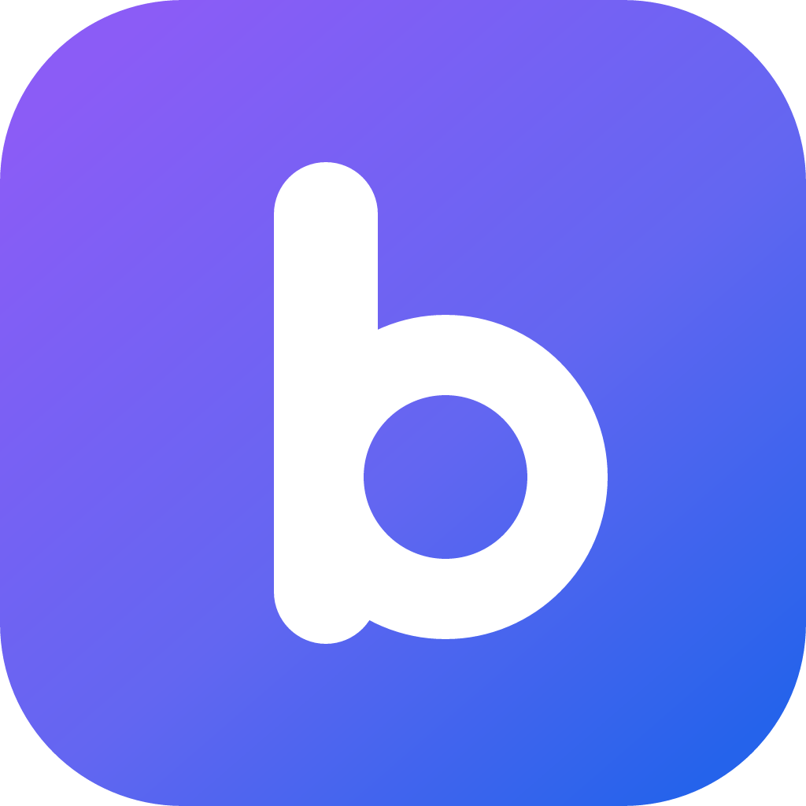
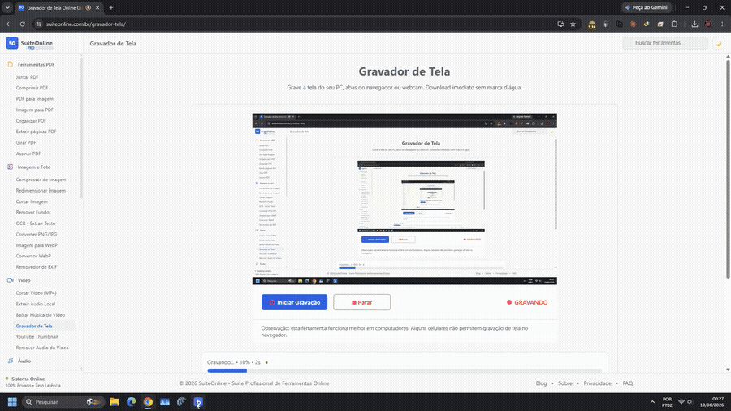

<p align="center">
  
</p>

<h1 align="center">Bah</h1>

<p align="center">
  <b>Navegador com IA</b> — você fala em português, ele opera a web pra você.<br/>
  Estilo <b>Perplexity Comet</b> · código aberto (source-available) · por <b>VilelaLab</b>.
</p>

<p align="center">
  <a href="https://github.com/alexvilelabah/bah-browser/releases"></a>
  <a href="https://github.com/alexvilelabah/bah-browser/releases/latest"></a>
</p>

> Você dá comandos em linguagem natural ("abre o gmail e apaga os spams") e a IA opera o navegador no seu lugar — vendo a tela, clicando com mouse real, digitando e seguindo até concluir.


## 🎬 Demonstração



▶️ **[Baixar o vídeo completo (2 min)](https://github.com/alexvilelabah/bah-browser/releases/download/v1.0.0/demo.mp4)** — o agente pesquisando e operando a web sozinho. *(o GIF acima é a prévia; o GitHub não toca vídeo embutido no README.)*

## 📥 Baixar

**🧑 Só quero usar (Windows):** [**baixe o instalador aqui**](https://github.com/alexvilelabah/bah-browser/releases/latest) → arquivo `Bah-Setup-*.exe`, clique 2× e instale.

> 🔄 **Atualiza sozinho:** depois de instalar, o Bah verifica novas versões, baixa em segundo plano e oferece *"Reiniciar agora"* pra aplicar — sem reinstalar nada.

> ⚠️ O Windows mostra uma tela azul *"protegeu seu PC"* (o app ainda não tem assinatura digital paga). Clique em **Mais informações → Executar assim mesmo** — é normal em apps novos de código aberto. (As atualizações seguintes entram sem esse aviso.)

**👨‍💻 Quero mexer no código:** clone e rode — veja [Como rodar](#como-rodar) logo abaixo.

---

## O que ele faz

- **Navegador completo** com abas, navegação, URL, tema dark
- **Painel AGENT** lateral: digita um comando → IA decide passo a passo até concluir
- **Lê a página** (DOM, elementos interativos numerados e OCR) e age por ferramentas estruturadas — sem depender de "enxergar" a tela
- **IA**: **DeepSeek** (nuvem) — testado e recomendado, rápido e estável — ou **Ollama** (local/offline) pra rodar a IA na própria máquina
- **Adblock** completo (EasyList + EasyPrivacy) com bypass automático para sites que quebram (YouTube, Twitch)
- **Safe Browsing** (URLhaus malicious hosts list, atualiza diariamente)
- **Cliques reais de mouse** via Chromium `sendInputEvent` (não synthetic events — passa por React, Vue, Angular sem ser ignorado)
- **Stealth** anti-detecção (UA Chrome, mascara `navigator.webdriver` etc.)
- **Overlay visual** estilo Comet — borda pulsante, scan line, ripple no clique, label de status

---

## Stack

| Camada | Tecnologia |
|---|---|
| Shell do navegador | **Electron 42** + Chromium |
| UI | **React 19** + **TypeScript** + Vite |
| IA (nuvem) | **DeepSeek** — testado e recomendado |
| IA (local) | **Ollama** |
| Adblock | `@ghostery/adblocker-electron` |
| Webview | Tag `<webview>` com partition persistente |

---

## Arquitetura

```
┌────────────────────────────────────────────────────────────────┐
│                         APP CONTAINER                          │
│  ┌──────────────────────────────────────────────────────────┐  │
│  │ TopBar: tabs + window controls                           │  │
│  ├──────────────────────────────────────────────────────────┤  │
│  │ AddressBar: URL + Adblock toggle + AI sidebar toggle     │  │
│  ├──────────────────────────────────┬───────────────────────┤  │
│  │                                  │                       │  │
│  │       <webview>                  │   AGENT PANEL         │  │
│  │       (page renders here)        │   - input             │  │
│  │       + AgentVisualOverlay       │   - thoughts/actions  │  │
│  │       (border, scan, ripples)    │   - results           │  │
│  │                                  │                       │  │
│  ├──────────────────────────────────┴───────────────────────┤  │
│  │ Footer (only on errors): selectable error text           │  │
│  └──────────────────────────────────────────────────────────┘  │
└────────────────────────────────────────────────────────────────┘
```

### Loop ReAct do agente (núcleo)

```
USER → "abre o gmail e apaga os spams"
        │
        ▼
┌───────────────────────────────────────────────┐
│  for step in 1..15:                           │
│    1. observePage(webview)                    │
│       → { url, title, interactive_elements }  │
│    2. captureScreenshot()                     │
│    3. AI decides ONE action:                  │
│       { action: { type, ...params } }         │
│    4. execute action via REAL OS input        │
│    5. wait, re-observe                        │
│    6. if action == 'done' → return            │
└───────────────────────────────────────────────┘
```

### Ferramentas que a IA pode chamar

| Ação | O que faz |
|---|---|
| `click_ref(N)` | Clica no elemento de id N da lista observada |
| `fill_ref(N, value)` | Preenche input de id N com `value` |
| `click_text(text)` | Acha por texto visível e clica |
| `click_at(x, y)` | Clique em coordenada exata (fallback visual) |
| `type(text)` | Digita no campo focado |
| `press(key)` | Tecla (Enter, Tab, Escape...) |
| `navigate(url)` | Vai pra URL |
| `scroll(direction)` | up / down / top / bottom |
| `new_tab(url)` / `switch_tab(N)` / `close_tab(N)` | Gerência de abas |
| `wait(ms)` | Pausa explícita |
| `done(reason, success)` | Encerra o loop |

#### Estratégia "DOM-first com fallback visual"

A IA tem três jeitos de clicar, e foi instruída a tentar nessa ordem:

1. **`click_ref(N)` — DOM semântico (preferencial)**
   Cada passo o navegador injeta JS na página, varre os elementos interativos visíveis (`<a>`, `<button>`, `<input>`, `[role=button]`, etc.), filtra os que estão na viewport e numera de 0 a N. Essa lista vai pra IA junto com `aria-label`, `pressed`, `checked`, `href`. A IA escolhe o id e o navegador resolve as coordenadas. **É o caminho mais confiável** — funciona mesmo quando o texto muda ou está duplicado.

2. **`click_text("X")` — busca por texto visível (fallback 1)**
   Quando o elemento que a IA quer não está nos top 200 da lista numerada (página gigante tipo YouTube), ela pode chamar por texto. O executor busca todos os elementos com aquele texto, prioriza match exato e penaliza prefixos negativos (não, no, cancelar) pra não clicar no botão errado.

3. **`click_at(x, y)` — coordenada visual (fallback 2)**
   Último recurso, só quando o elemento é ícone-only sem `aria-label` ou está dentro de canvas. ⚠️ Só funciona com **provedor de visão** (ex.: Pollinations); com **DeepSeek o screenshot não é enviado ao modelo**, então o agente prioriza os elementos do DOM. Quando há visão, a IA estima a coordenada e o navegador usa `document.elementFromPoint()`.

**Em todos os três casos**, o clique final acontece via `webContents.sendInputEvent` no main process — ou seja, é um evento de mouse **real** do Chromium, não synthetic event. Sites com React/Vue/proteção anti-bot respondem normalmente.

---

## Estrutura do código

```
src/
├── main/                          # Electron main process (Node.js)
│   ├── main.ts                    # Bootstrap, IPC handlers, adblock, safe-browsing,
│   │                              # stealth UA, real mouse input via sendInputEvent
│   ├── ai-engine.ts               # Cliente de IA (DeepSeek nuvem / Ollama local).
│   │                              # System prompt do agente.
│   └── page-agent.ts              # Parser/normalizador da resposta JSON da IA
│
├── preload/
│   └── preload.ts                 # contextBridge — expõe APIs main p/ renderer
│
└── renderer/                      # UI React
    ├── App.tsx                    # Loop principal do agente, state, render layout
    ├── store.ts                   # Hook de estado (tabs, chat, AI settings)
    ├── page-executor.ts           # observePage(), executeBrowserAction(), helpers
    │                              # de DOM injection para coletar interactive_elements
    ├── components/
    │   ├── TabBar.tsx             # Barra de abas estilo Chrome
    │   ├── AddressBar.tsx         # URL + nav buttons
    │   ├── AgentCommandBar.tsx    # Painel direito do agente (input + log)
    │   ├── WebViewContainer.tsx   # Container das <webview> com refs
    │   └── AgentVisualOverlay.tsx # Overlay visual (borda, scan, ripples)
    └── styles/
        └── global.css             # Tema dark + animações
```

### Arquivos-chave para revisão

Se quiser entender o projeto rápido, leia nessa ordem:

1. **`src/renderer/App.tsx`** — onde o loop ReAct mora. Ler o `onExecute` do `<AgentCommandBar>`.
2. **`src/main/ai-engine.ts`** — system prompt + chamadas pra cada provider.
3. **`src/renderer/page-executor.ts`** — como observamos a página (`OBSERVE_SCRIPT`) e executamos ações.
4. **`src/main/main.ts`** — IPC handlers de `realClick`, `realType`, accessibility tree CDP, adblock, safe browsing.

---

## Como rodar

```bash
# 0. Clonar o repositório
git clone https://github.com/alexvilelabah/bah-browser.git
cd bah-browser

# 1. Instalar deps
npm install

# 2. Build (compila TS main + bundle Vite)
npm run build

# 3. Rodar
npm start
# ou: npx electron .
```

Atalho Windows: clique duplo em `Abrir-Bah.bat`.

### Configurar IA

1. Abra o navegador
2. Clique no ícone **AI** na barra de endereço (canto direito)
3. Engrenagem → escolher Provider
4. Colar API key (ou deixar vazio se for Ollama local)
5. Save

**Modo local (Ollama):** instale o [Ollama](https://ollama.com) e **deixe o app aberto** (ele fica na bandeja, perto do relógio — é ele que serve os modelos em `127.0.0.1:11434`). Com o Ollama rodando, baixe um modelo pelo gerenciador dentro do Bah (☁️/🏠 → 🏠 IA Local → digite o nome e clique em **Baixar**) ou no terminal (ex.: `ollama pull qwen2.5:14b`). Roda offline, mas a nuvem (DeepSeek) é mais confiável.

---

## Comparação com outros agentes

|  | **Bah** | Comet | Tandem | Browser-Use |
|---|---|---|---|---|
| Código-fonte aberto | ✅ | ❌ | ✅ | ✅ |
| Opção 100% local (Ollama) | ✅ | ❌ | ✅ | ✅ |
| Roda em casa | ✅ | ❌ | ✅ | ❌ (só lib) |
| IA na nuvem ou local | ✅ | ❌ (só nuvem) | ✅ | ✅ |
| Cliques reais (não synthetic) | ✅ | ✅ | ✅ | ✅ |
| Accessibility tree (CDP) | ✅ | ✅ | ✅ | ⚠️ |
| UI completa | ✅ | ✅ | ✅ | ❌ |
| Adblock + Safe browsing | ✅ | ✅ | ⚠️ | ❌ |

> ℹ️ Os ✅ indicam recursos **presentes no código**. O caminho de IA **testado e recomendado é o DeepSeek (nuvem)**; o modo local (Ollama) também funciona, mas é **menos validado**.

---

## Segurança e limites

O agente opera com privilégios elevados de navegador, então é importante deixar claro o que ele faz e não faz:

- **Sessão é a sua sessão real.** O navegador usa partition persistente (`persist:browser`), então cookies e logins ficam salvos. Se você está logado no Gmail no Bah, o agente também está. **A IA tem acesso a tudo que você teria acesso manualmente.** Não logue em contas que você não confiaria a um assistente.

- **Sem confirmação humana entre passos (atualmente).** Quando o agente decide clicar em "Excluir", ele clica direto. Não há pop-up "tem certeza?" entre ações. Para tarefas destrutivas (apagar emails, deletar arquivos, comprar, transferir dinheiro), recomendo dar comandos pequenos e observar.

- **Listas com toggle são detectadas.** O agente lê `aria-pressed` e `aria-checked` antes de agir, então não fica num loop liga/desliga (ex: dando like infinito).

- **Limite de 15 passos por comando.** Se a tarefa não concluir em 15 ações, o agente para sozinho.

- **Detecção de ação sem efeito.** Se duas ações seguidas não mudarem nada na página, o sistema avisa a IA pra mudar de estratégia (em vez de repetir infinitamente).

- **Stealth não é evasão.** Mascaramos `navigator.webdriver` e usamos UA Chrome só para reduzir rejeições. Não burlamos CAPTCHA, não evitamos rate-limit, não automatizamos coisas que sites proíbem nos termos de uso.

- **🔑 Login do Google — use o menu "Entrar no Google".** O Google bloqueia login *dentro* de navegadores embutidos (Electron/webview) — *"este navegador pode não ser seguro"*. O Bah resolve do jeito certo: clique em **🔑 Entrar no Google** (no painel do agente, ou no menu ⋮) → ele abre o login no seu **Chrome/Edge real** (onde o Google confia). Você loga lá e **pronto** — o Bah **detecta sozinho**, importa a sessão (cookies via CDP, sem decifrar nada no disco) e fecha o navegador de login. Faça **uma vez** e fica logado (Gmail, YouTube, etc.), inclusive depois de reabrir.

- **Adblock pausa em sites conhecidos.** YouTube e Twitch entram em modo bypass automático para o player não ser bloqueado pelo anti-adblock deles. Outros sites: o adblock fica ativo.

- **Safe Browsing.** Navegação para hosts em listas de phishing/malware (URLhaus) é bloqueada com aviso.

**O que NÃO está implementado ainda** (mas seria bom): aprovação humana antes de ações destrutivas (delete/buy/send), sandbox separado por aba, rate-limit de cliques pra evitar comportamento de bot agressivo.

---

## Roadmap

Status atual:

- [x] **Loop ReAct multi-passo** com observação estruturada
- [x] **Cliques reais** via `sendInputEvent` (não synthetic)
- [x] **Adblock + Safe Browsing** com bypass automático por site
- [x] **Stealth básico** (UA + `navigator.webdriver`)
- [x] **IA na nuvem (DeepSeek, testado) ou local (Ollama)**
- [x] **Visual overlay** estilo Comet
- [x] **Accessibility tree via CDP** — IPC handler já existe (`cdp:axtree`), falta usar no loop
- [ ] **Migrar `<webview>` → `WebContentsView`** — *prioridade alta*. A tag `<webview>` está [oficialmente deprecated](https://www.electronjs.org/docs/latest/api/webview-tag) e tem várias quirks (skeleton bug do YouTube, problemas com IntersectionObserver). `WebContentsView` (Electron 30+) é o caminho moderno e dá acesso direto ao `webContents` sem o sandbox aninhado. **Refator grande**: muda o jeito que tabs são gerenciadas. Vale o esforço quando for estabilizar pra produção.
- [ ] **RAG entre abas** — indexar conteúdo das abas em vetores pra IA responder "compare X em duas abas". Provavelmente com `@xenova/transformers` rodando local.
- [ ] **Whitelist de adblock por site** editável pelo usuário (botão "permitir nesse site")
- [ ] **Confirmação humana** antes de ações destrutivas (`require_confirmation: true` em ações marcadas)
- [ ] **Persistir abas/histórico** entre sessões
- [ ] **Voice command** (input de áudio)
- [ ] **Eval suite** — rodar tarefas-padrão (login, search, fill form) automaticamente pra detectar regressões

---

## Licença

**PolyForm Small Business 1.0.0** — veja o arquivo [LICENSE](LICENSE).

Em resumo (este resumo não tem valor legal — vale o texto da licença):

- ✅ **Livre** para uso pessoal, estudo, projetos próprios e **empresas pequenas** (menos de 100 pessoas **e** menos de US$ 1 milhão de faturamento no último ano).
- ✅ Pode **modificar, melhorar e redistribuir**, mantendo este aviso de licença.
- 💼 **Empresa grande / uso comercial acima desse porte** precisa de uma **licença comercial** do autor — fale comigo em **alexmachadovilela@gmail.com**.
- ❌ Sem garantia. O software vem "como está".

---

## Contato

- 📧 **Email** (dúvidas e licença comercial): **alexmachadovilela@gmail.com**
- 🐦 **X / Twitter**: [@alexvilelaba](https://x.com/alexvilelaba)
- 🐛 **Bugs / ideias**: [abra uma issue](https://github.com/alexvilelabah/bah-browser/issues)

Feito com 🧉 por **Alex Vilela** — **VilelaLab**.
